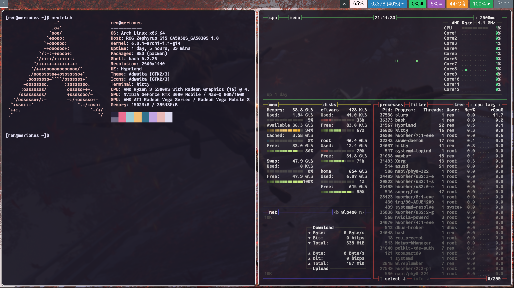

# fancy-border

<div align = center>



<br>

<div align = left>

Replaces rounded corners with chamfered corners. Currently, it functions pretty much the same as borders++, but it also loads in a different border shader and swaps out the default shader and back when renderBorder is called.  

Example Config:
```
plugin {
    fancy-border {
        add_borders = 1 # 0 - 9

        # you can add up to 9 borders
        col.border_1 = rgb(ffffff)
        col.border_2 = rgb(2222ff)

        # -1 means "default" as in the one defined in general:border_size
        border_size_1 = 10
        border_size_2 = -1

        # makes outer edges match rounding of the parent. Turn on / off to better understand. Default = on.
        natural_rounding = yes
    }
}
```
