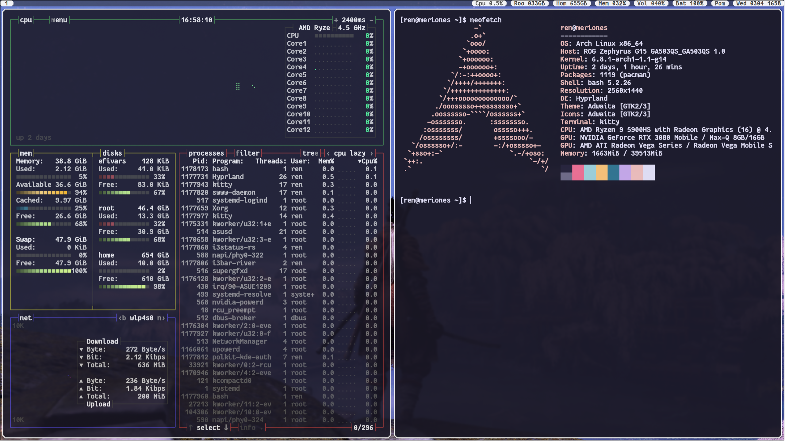

# fancy-border

<div align = center>



<br>

<div align = left>

Replaces rounded corners with chamfered corners. Currently, it functions pretty much the same as borders++, but it also loads in a slightly different border shader. The rendering is done by incorporating a copy of the renderBorder() function from the Hyprland source (src/Hyprland/src/render/OpenGl.cpp) so this plugin has a tendency to break (often) whenever there's a Hyprland or hyprland-plugin update.

currently this works with:
hyprland-git (v0.44.0)
hyprland-plugins-git (v0.44.0)


## Building:

Ensure hyprland and hyprland-plugins is installed:
Use `make` or meson/ninja to build.
The compile output needs to exist in /usr/lib/hyprland-plugins/ to satisfy dependencies.


## Example Config:
```
exec-once = hyprctl plugin load /usr/lib/hyprland-plugins/fancy-borders.so

# remove the default border by setting to 0
general { border_size = 0 }

# border radius is controlled by decoration config
decoration { rounding = 6 }

plugin {
    fancy-borders {
        add_borders = 2 # 0 - 9

        # you can add up to 9 borders
        col.border_1 = rgb(888888ee)
        col.border_2 = rgb(e0def4ee)

        border_size_1 = 2
        border_size_2 = 3
    }
}
```
